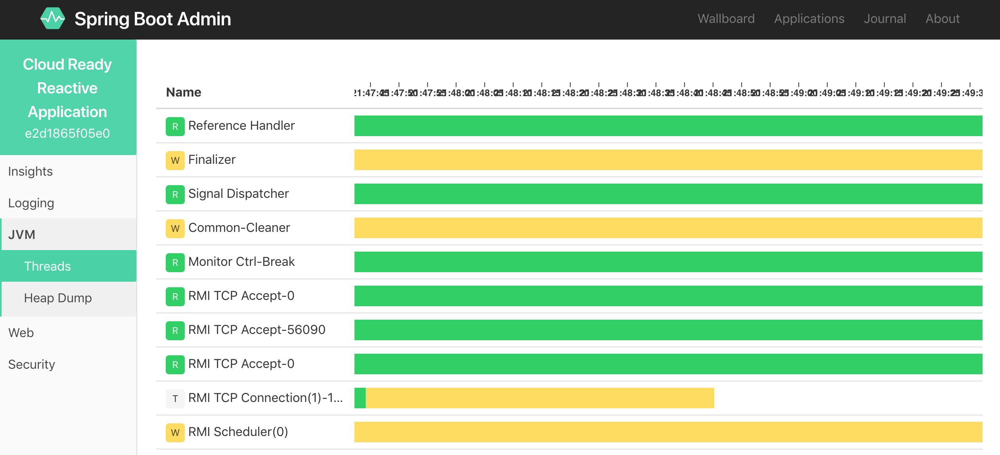
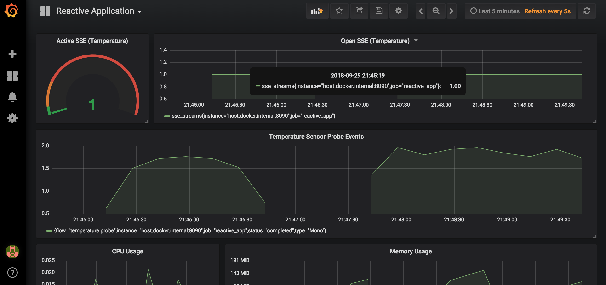

# Hands-On Reactive Programming in Spring 5

_Published by Packt_

Build cloud-ready, reactive systems with Spring 5.1 and Project Reactor.

**The code for this repository is under development** :construction_worker:

## General requirements

All code samples should run on any operating system where the appropriate Java runs.
Some examples require Docker Engine.

### OS requirements

There is no hard requirement for OS. 
However, examples use JDK8 and later, Docker Engine 18.06 and later, and also download native executables (embedded MongoDB).
Consequently, for successful execution, all software described above should work on your OS.

Tested operation systems: MacOS High Sierra, Windows 10.

### Java

All examples were developed with JDK8 and tested to be compatible with JDK11.
Because of the significant changes introduced by JDK11, some examples may display warnings or run only on JDK8.

To install JDK8, please refer to these instructions: <http://jdk.java.net/8>

To install JDK11, please refer to these instructions: <http://jdk.java.net/11>

### Docker

A couple of examples assume running Docker Engine to start supporting services (MongoDB, PostgreSQL, Prometheus, etc.)

Only Chapter 10's example requires running Docker commands manually, other examples do automatic service provisioning.

To install Docker Engine on your PC, please follow the official instructions: <https://docs.docker.com/install>

### IDE

All examples use Gradle build system, so they are not IDE dependent. 
However, we recommend using a free version of IntelliJ IDEA for a seamless exploration of the provided examples.
We recommend using the latest version of IntelliJ IDEA as it has better support for JDK11.

The Community Edition of IntelliJ IDEA may be downloaded here: <https://www.jetbrains.com/idea/download>

Many examples use a handy the Lombok library (<https://projectlombok.org/>) which require annotation processing.
Consequently, please install **IntelliJ Lombok plugin** (<https://github.com/mplushnikov/lombok-intellij-plugin>).


Also, please **enable annotation processing** in IDE (`Preferences` -> `Build, Execution, Deployment` -> `Complier` -> `Annotation Processors` -> Check `Enable annotation processing`).


When IDE is installed and configured, you may open this project as Gradle project.
Then, please **define JDK** for the project (`File` -> `Project Structure` -> `Project Settings` -> `Project` -> `Project SDK`).

Then, rebuild all modules of the project (`Build` -> `Rebuild Project`).
Now, you may explore and run all examples.

## Disclaimer

All code in this repository is for demonstration purposes and, consequently, often oversimplified.
Also, the code in this repository is **not production ready** and may require some improvements and additional testing. 

## Chapter 1

Contains the following examples:

* `ChapterFirstApplication` - a web application that demonstrates the blocking communication approach.
* `imperative.OrdersService` - a console application that demonstrates the synchronous, blocking approach for components interactions.
* `callbacks.OrdersService` - a console application that demonstrates the callback-based approach for components interactions.
* `futures.OrdersService` - a console application that demonstrates the `Future` based approach for components interactions.
* `completion_stage.OrdersService` - a console application that demonstrates the `CompletionStage` based approach for components interactions.

## Chapter 2

* Module unit tests show examples of the Observer pattern and reactive workflows with RxJava 1.
* `pub_sub_app.Application` - a web application that demonstrates how Spring 4 enables asynchronous execution with `ApplicationEventPublisher` and SSE.
* `rx_app.Application` - a web application that demonstrates how Spring 4 enables asynchronous execution with RxJava 1.x and SSE.
* `rx_app_no_logs.Application` - a web application that demonstrates how Spring 4 enables asynchronous execution with RxJava 1.x and SSE.

## Chapter 3

* `conversion_problem` - a web application (with corresponding unit tests) demonstrates how to convert different types of futures.
* `async.vs.reactive` - unit tests compares the asynchronous and reactive approached (`Publisher` as `CompletableFuture`, `CompletableFuture` as `Publisher`).
* `news-service.NewsServiceApp` - th console application that demonstrates custom implementation of Reactive Streams' interfaces (`Publisher`, `Subscriber`, `Processor`). **Works with JDK8, fail with JDK11**. 
* `news-service` unit tests show how to test custom implementation of Reactive Streams with TCK. Tests are based on TestNG. **Works with JDK8, may fail with JDK11**. Tests may run long!
* `jdk9` - a console application that demonstrates how to adapt `reactive-streams` types to Java Flow API. **This application requires at least JDK9**.
* `push.vs.pull` - classes and unit tests that demonstrate different approaches for data retrieval (pull, batched pull, push, push-pull).
* `rxjava-reactivestreams-ratpack.LogServiceApplication` - a web application that demonstrates the power of Reactive Streams for integration of reactive libraries (Spring, Ratpack, RxJava, etc.). **Works with JDK8, may fail with JDK11**.
* `vert.x.VertxDemoApp` - a web application that demonstrates how Verte.x integrates with Reactive Streams. 

## Chapter 4

* Module unit tests show examples of reactive workflows with Project Reactor.

## Chapter 5

* Module unit tests show how Spring's reactive adapters work.
* `Chapter5ReactiveApplication` - web reactive application that simulates IoT sensor (SSE, MongoDB write, MongoDB read).

## Chapter 6

## Chapter 7

* `section-01-jdbc` - a blocking console application that demonstrates Jdbi library, Spring JDBC and Spring Data JDBC (runs embedded H2 database).
* `section-02-jpa` - a blocking console application that demonstrates Spring Data JPA (runs embedded H2 database).
* `section-03-mongo` - a blocking console application that demonstrates Spring Data Mongo (runs embedded MongoDB)
* `section-04-rx-mongo` - a reactive console application that demonstrates **reactive Spring Data Mongo** (runs embedded MongoDB).
* `section-05-rx-mongo-tx` - unit tests that demonstrate how reactive transactions work with MongoDB 4 (runs MongoDB cluster in Docker).
* `section-06-r2dbc` - a reactive console application that demonstrates how Spring Data JDBC and **R2DBC** work together (runs PostgreSQL in docker).
* `section-07-rx-webflux` - a reactive web application (SSE) that simulates simple chat application (embedded MongoDB).
* `section-08-rx-dbs` - code samples that demonstrate different types of reactive repositories (MongoDB, Cassandra, Couchbase, Redis).
* `section-09-rx-sync` - a console application that demonstrates how to wrap blocking JPA repository into reactive repository (runs embedded H2 database).
* `section-10-rxjava2-jdbc` - a console application that demonstrates how to use the `rxjava2-jdbc` library for reactive communication over blocking JDBC (runs embedded H2 database).

## Chapter 8

## Chapter 9

* `DemoApplication` - a web application used for testing with a reactive test framework.
* Module unit tests demonstrate how to verify reactive applications with `WebTestClient` (including security).

## Chapter 10 

This sample depicts a reactive application based on Spring Boot 2 and WebFlux with all required infrastructure for operational monitoring.

Prometheus pulls metrics, Grafana has a simple dashboard with app metrics, Zipkin gathers traces.

### Application structure

- Application itself:
  - Reactive Web App (with Spring Boot Admin)
  - Database: MongoDB (used only for health checks)
- Monitoring infrastructure:
  - Prometheus
  - Grafana
  - Zipkin
  
### Start or stop infrastructural services

To start services run the following command:

```bash
docker-compose -f chapter-10/docker/docker-compose.yml up -d
```

To stop services run the following command:

```bash
docker-compose -f chapter-10/docker/docker-compose.yml down
```

### Start Spring Boot application

To start the application, run class 
`org.rpis5.chapters.chapter_10.Chapter10CloudReadyApplication`.
  
### Accessing application components
  
- Reactive Web Application: <http://localhost:8080>
- Spring Boot Admin 2.0: <http://localhost:8090/admin> (authentication disabled)
- Prometheus: <http://localhost:9090>
- Grafana: <http://localhost:3000> (user: `admin`, password: `admin`)
- Zipkin: <http://localhost:9411>

### Screenshots of a successfully started application

Application web page:


Spring Boot Admin:



Zipkin report page:


Application monitoring dashboard provided by Grafana over Prometheus' metrics:



## Feedback

Your feedback is important for us, so do not hesitate [creating issues](https://github.com/PacktPublishing/Hands-On-Reactive-Programming-in-Spring-5/issues) if some examples do not work with your environment.

Also, please **star of fork this repository** if you find it useful!

Thanks!

