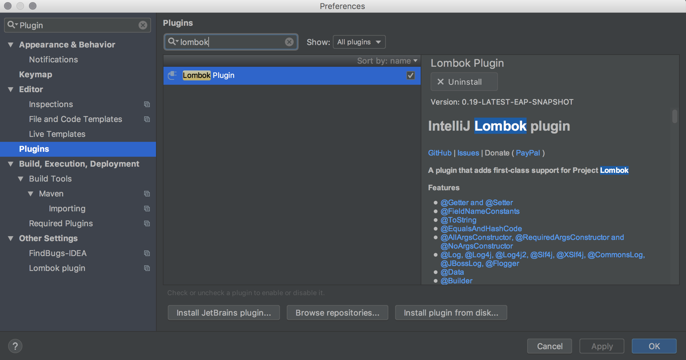
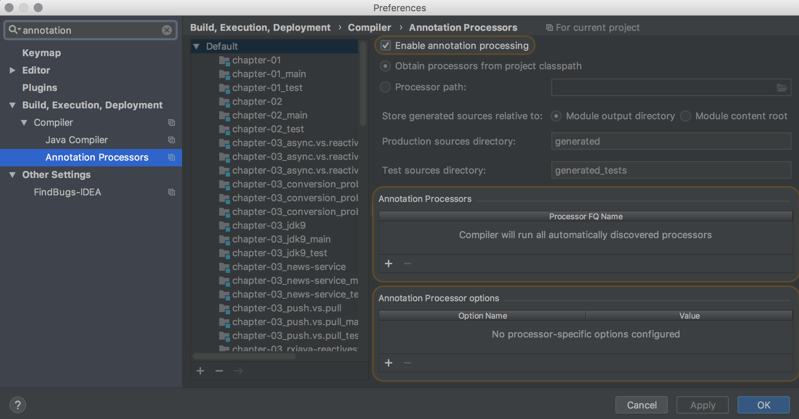

# Hands-On Reactive Programming in Spring 5

<a href="https://www.packtpub.com/application-development/hands-reactive-programming-spring-5"></a>

This is the code repository for [Hands-On Reactive Programming in Spring 5](https://www.packtpub.com/application-development/hands-reactive-programming-spring-5), published by Packt.

**Build cloud-ready, reactive systems with Spring 5 and Project Reactor**

## What is this book about?

* Discover the difference between a reactive system and reactive programming
* Explore the benefits of a reactive system and understand its applications
* Get to grips with using reactive programming in Spring 5
* Gain an understanding of Project Reactor
* Build a reactive system using Spring 5, Spring WebFlux, and Project Reactor
* Explore reactive data access with Spring Data
* Create a highly efficient reactive microservices with Spring Cloud
* Test, monitor, and release reactive applications

If you feel this book is for you, get your [copy](https://www.amazon.in/Hands-Reactive-Programming-Spring-cloud-ready-ebook/dp/B076QCBXZ2) today!

## Authors

#### Oleh Dokuka

Oleh Dokuka is an experienced software engineer, Pivotal Champion, and one of the top contributors to Project Reactor and Spring Framework. He knows the internals of both frameworks very well and advocates reactive programming with Project Reactor on a daily basis. Along with that, the author applies Spring Framework and Project Reactor in software development, so he knows how to build reactive systems using these technologies.

#### Igor Lozynskyi

Igor Lozynskyi is a senior Java developer who primarily focuses on developing reliable, scalable, and blazingly fast systems. He has over seven years of experience with the Java platform. He is passionate about interesting and dynamic projects both in life and in software development.

## General requirements

All code samples should run on any operating system where the appropriate Java runs.
Some examples require Docker Engine.

### OS requirements

There is no hard requirement for OS. 
However, examples use JDK8 and later, Docker Engine 18.06 and later, and also download native executables (embedded MongoDB).
Consequently, for successful execution, all software described above should work on your OS.

Tested operation systems: MacOS High Sierra, Windows 10, Ubuntu Linux 16.04 LTS.

### Java

All examples were developed with JDK8 and tested to be compatible with JDK11.
Because of the significant changes introduced by JDK11, some examples may display warnings or run only on JDK8.

To install JDK8, please refer to these instructions: <http://jdk.java.net/8>

To install JDK11, please refer to these instructions: <http://jdk.java.net/11>

### Docker

A couple of examples assume running Docker Engine to start supporting services (MongoDB, PostgreSQL, Prometheus, etc.)

Only Chapter 10's example requires running Docker commands manually, other examples do automatic service provisioning.

To install Docker Engine on your PC, please follow the official instructions: <https://docs.docker.com/install>

### IDE

All examples use Gradle build system, so they are not IDE dependent. 
However, we recommend using a free version of IntelliJ IDEA for a seamless exploration of the provided examples.
We recommend using the latest version of IntelliJ IDEA as it has better support for JDK11.

The Community Edition of IntelliJ IDEA may be downloaded here: <https://www.jetbrains.com/idea/download>

Many examples use a handy the Lombok library (<https://projectlombok.org/>) which require annotation processing.
Consequently, please install **IntelliJ Lombok plugin** (<https://github.com/mplushnikov/lombok-intellij-plugin>).



Also, please **enable annotation processing** in IDE (`Preferences` -> `Build, Execution, Deployment` -> `Complier` -> `Annotation Processors` -> Check `Enable annotation processing`).



When IDE is installed and configured, you may open this project as Gradle project.
Then, please **define JDK** for the project (`File` -> `Project Structure` -> `Project Settings` -> `Project` -> `Project SDK`).

Then, rebuild all modules of the project (`Build` -> `Rebuild Project`).
Now, you may explore and run all examples.

## Disclaimer

All code in this repository is for demonstration purposes and, consequently, often oversimplified.

## Chapter 1: Why Reactive Spring?

Contains the following examples:

* `ChapterFirstApplication` - a web application that demonstrates the blocking communication approach.
* `imperative.OrdersService` - a console application that demonstrates the synchronous, blocking approach for components interactions.
* `callbacks.OrdersService` - a console application that demonstrates the callback-based approach for components interactions.
* `futures.OrdersService` - a console application that demonstrates the `Future` based approach for components interactions.
* `completion_stage.OrdersService` - a console application that demonstrates the `CompletionStage` based approach for components interactions.

## Chapter 2: Reactive Programming in Spring - Basic Concepts

* Module unit tests show examples of the Observer pattern and reactive workflows with RxJava 1.
* `pub_sub_app.Application` - a web application that demonstrates how Spring 4 enables asynchronous execution with `ApplicationEventPublisher` and SSE.
* `rx_app.Application` - a web application that demonstrates how Spring 4 enables asynchronous execution with RxJava 1.x and SSE.
* `rx_app_no_logs.Application` - a web application that demonstrates how Spring 4 enables asynchronous execution with RxJava 1.x and SSE.

## Chapter 3: Reactive Streams - the New Streams' Standard

* `conversion_problem` - a web application (with corresponding unit tests) demonstrates how to convert different types of futures.
* `async.vs.reactive` - unit tests compares the asynchronous and reactive approached (`Publisher` as `CompletableFuture`, `CompletableFuture` as `Publisher`).
* `news-service.NewsServiceApp` - the console application that demonstrates custom implementation of Reactive Streams' interfaces (`Publisher`, `Subscriber`, `Processor`). **Works with JDK8, fail with JDK11**. 
* `news-service` unit tests show how to test custom implementation of Reactive Streams with TCK. Tests are based on TestNG. **Works with JDK8, may fail with JDK11**. Tests may run long!
* `jdk9` - a console application that demonstrates how to adapt `reactive-streams` types to Java Flow API. **This application requires at least JDK9**.
* `push.vs.pull` - classes and unit tests that demonstrate different approaches for data retrieval (pull, batched pull, push, push-pull).
* `rxjava-reactivestreams-ratpack.LogServiceApplication` - a web application that demonstrates the power of Reactive Streams for integration of reactive libraries (Spring, Ratpack, RxJava, etc.).
* `vert.x.VertxDemoApp` - a web application that demonstrates how Verte.x integrates with Reactive Streams. 

## Chapter 4: Project Reactor - the Foundation for Reactive Apps

* Module unit tests show examples of reactive workflows with Project Reactor.

## Chapter 5: Going Reactive with Spring Boot 2

* Module unit tests show how Spring's reactive adapters work.
* `Chapter5ReactiveApplication` - web reactive application that simulates IoT sensor (SSE, MongoDB write, MongoDB read).

## Chapter 6: WebFlux Async Non-blocking Communication

* `functional` - a few examples of usage of function web approach with new WebFlux module mentioned in section _Purely functional web with WebFlux_
* `webclient` - an example of the `WebClient` usage mentioned in section _Non-blocking cross-service communication with WebClient_. In addition, another example mentioned in this section is located in the following package: `org.rpis5.chapters.chapter_06.functional.password.verification.client`
* `websocket` - new reactive WebSocket API examples mentioned in section _Reactive WebSocket API_
* `sse` - an example of Server-sent events usage in section _Reactive SSE as a lightweight replacement for WebSockets_

## Chapter 7: Reactive Database Access

* `section-01-jdbc` - a blocking console application that demonstrates Jdbi library, Spring JDBC and Spring Data JDBC (runs embedded H2 database).
* `section-02-jpa` - a blocking console application that demonstrates Spring Data JPA (runs embedded H2 database).
* `section-03-mongo` - a blocking console application that demonstrates Spring Data MongoDB (runs embedded MongoDB)
* `section-04-rx-mongo` - a reactive console application that demonstrates reactive Spring Data MongoDB (runs embedded MongoDB).
* `section-05-rx-mongo-tx` - unit tests that demonstrate how reactive transactions work with MongoDB 4 (runs MongoDB cluster in Docker).
* `section-06-r2dbc` - a reactive console application that demonstrates how Spring Data JDBC and **R2DBC** work together (runs PostgreSQL in docker).
* `section-07-rx-webflux` - a reactive web application (SSE) that simulates simple chat application (embedded MongoDB).
* `section-08-rx-dbs` - code samples that demonstrate different types of reactive repositories (MongoDB, Cassandra, Couchbase, Redis).
* `section-09-rx-sync` - a console application that demonstrates how to wrap blocking JPA repository into reactive repository (runs embedded H2 database).
* `section-10-rxjava2-jdbc` - a console application that demonstrates how to use the `rxjava2-jdbc` library for reactive communication over blocking JDBC (runs embedded H2 database).

## Chapter 8: Scaling Up with Cloud Streams

### Cloud-Stream
this is an example of Chat application that is fully decoupled and ready to be run in the cloud. The following is a steps required to prepare this sample:
 
#### Preparing MongoDB

The Project uses [MongoDB](https://www.mongodb.com/) as the primary database for all data's querying and storing.

There are two available options in order to install MongoDB: 

##### (Option 1) Dockerized MongoDB

> Note, that option requires the essential understanding of the [Docker's CLI] (https://docs.docker.com/engine/reference/commandline/cli/)

> Before starting that option, please ensure that [Docker](https://docs.docker.com/install/) (has already been installed on the local machine).

It is necessary to execute the following command in the terminal to run MongoDB image in the Docker container:  

``` SH
docker run --name test-mongo -p 27017:27017 -d mongo
```

##### (Option 2) Local Community MongoDB Server

There is an option to install MongoDB locally. All required information related to the local installation is available by the following [link](https://www.mongodb.com/download-center?jmp=nav#community).

#### Preparing RabbitMQ

The Project uses [RabbitMQ](https://www.rabbitmq.com/) as a message broker for this 
example 

There are two available options in order to install RabbitMQ: 

##### (Option 1) Dockerized RabbitMQ

> Note, that option requires the essential understanding of the [Docker's CLI] (https://docs.docker.com/engine/reference/commandline/cli/)

> Before starting that option, please ensure that [Docker](https://docs.docker.com/install/) (has already been installed on the local machine).

It is necessary to execute the following command in the terminal to run MongoDB image in the Docker container:  

``` SH
docker run --name test-rabbit -p 4369:4369 -p 5671:5671 -p 5672:5672 -p 25672:25672 -d rabbitmq
```

##### (Option 2) Local Community MongoDB Server

There is an option to install RabbitMQ locally. All required information related to the 
local installation is available by the following [link](http://www.rabbitmq.com/download.html).


#### Preparing the Environment

To properly run the Project the proper environment variables / YAML properties are required. The following is the list of available *Spring Framework* properties/environment variables: 

| Spring property | Environment variable | Description |
| --------------- | -------------------- | ----------- |
| `gitter.auth.token` | `GITTER_TOKEN` | Personal Access Token which can be used to access the Gitter API. | 
| `gitter.api.endpoint` | - | The address of public Gitter REST API endpoint. The default value is [https://api.gitter.im/](https://api.gitter.im/). To learn more, [see following API docs](https://developer.gitter.im/docs/rest-api) |
| `gitter.api.version` | - | The version of the Gitter REST API. The default value is `v1`. |
| `gitter.api.messages-resource` | `GITTER_ROOM` | Path to the Messages Resource. **Note**, in environment variable case, it is unnecessary defining the whole path since it has already been defined as the following: `rooms/${GITTER_ROOM}/chatMessages`. To get created Gitter room id, please [see API docs](https://developer.gitter.im/docs/rooms-resource#list-rooms). |
| `gitter.stream.endpoint` | - | The address of public Gitter Streaming API endpoint. The default value is [https://stream.gitter.im/](https://stream.gitter.im/). To learn more, [see following API docs](https://developer.gitter.im/docs/streaming-api)  |
| `gitter.stream.version` | - | The version of the Gitter Streaming API. The default value is `v1`. |
| `gitter.stream.messages-resource` | `GITTER_ROOM` | Path to the Messages Resource. **Note**, in environment variable case, it is unnecessary defining the whole path since it has already been defined as the following: `rooms/${GITTER_ROOM}/chatMessages`. To get created gitter room id, please [see API docs](https://developer.gitter.im/docs/rooms-resource#list-rooms). | 

## Chapter 9: Testing the Reactive Application

* `DemoApplication` - a web application used for testing with a reactive test framework.
* Module unit tests demonstrate how to verify reactive applications with `WebTestClient` (including security).

## Chapter 10: And, Finally, Release It!

This sample depicts a reactive application based on Spring Boot 2 and WebFlux with all required infrastructure for operational monitoring.

Prometheus pulls metrics, Grafana has a simple dashboard with app metrics, Zipkin gathers traces.

### Application structure

- Application itself:
  - Reactive Web App (with Spring Boot Admin)
  - Database: MongoDB (used only for health checks)
- Monitoring infrastructure:
  - Prometheus
  - Grafana
  - Zipkin
  
### Start or stop infrastructural services

To start services run the following command:

```bash
docker-compose -f chapter-10/docker/docker-compose.yml up -d
```

To stop services run the following command:

```bash
docker-compose -f chapter-10/docker/docker-compose.yml down
```

### Start Spring Boot application

To start the application, run class 
`org.rpis5.chapters.chapter_10.Chapter10CloudReadyApplication`.
  
### Accessing application components
  
- Reactive Web Application: <http://localhost:8080>
- Spring Boot Admin 2.0: <http://localhost:8090/admin> (authentication disabled)
- Prometheus: <http://localhost:9090>
- Grafana: <http://localhost:3000> (user: `admin`, password: `admin`)
- Zipkin: <http://localhost:9411>

## Feedback

Your feedback is important for us, so do not hesitate [creating issues](https://github.com/PacktPublishing/Hands-On-Reactive-Programming-in-Spring-5/issues) if some examples do not work with your environment.

Also, please **star of fork this repository** if you find it useful!

Thanks!

